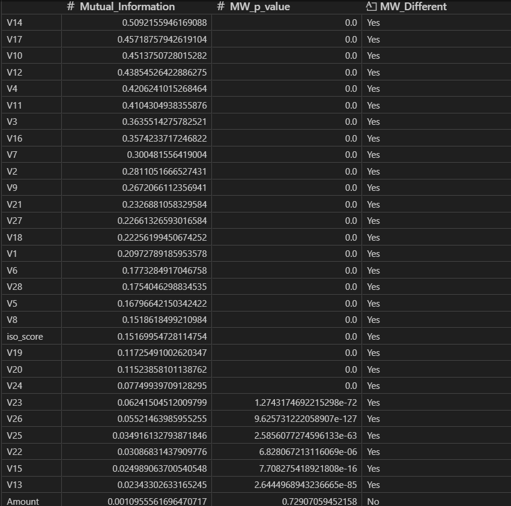
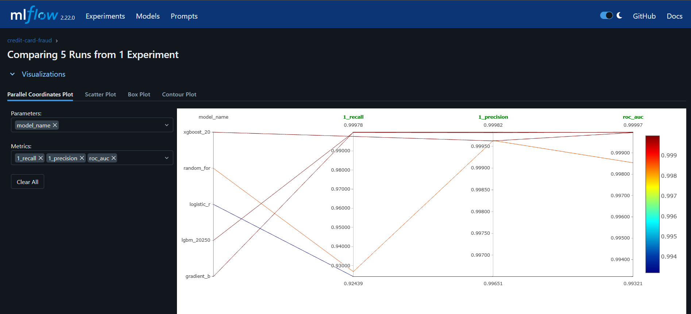

# MLOPS-project-Credit-Card-Fraud-Detection 🚀

   
   
   
   
   
   
  

Proyecto **end-to-end MLOps** para detección de fraude en transacciones con tarjetas de crédito. Implementa **data versioning, experiment tracking, pipelines modulares, automatización de selección de modelos**, despliegue con Flask y Docker, CI/CD con GitHub Actions y automatización de infraestructura en AWS usando Terraform.

---

## 🔹 Tecnologías y prácticas usadas

- **Data Versioning:** DVC  
- **Experiment Tracking:** MLflow  
- **Pipeline modular:** Programación orientada a objetos (OOP)  
- **Selección automática del mejor modelo:** Fórmula ponderada para métricas  
- **Despliegue:** Flask + Docker  
- **CI/CD:** GitHub Actions  
- **Infraestructura en AWS:** ECR + EC2 + self-hosted runner  
- **Automatización:** Terraform (Crea el ECR + EC2 e instalar docker)

---

## 📊 Datos

- **Fuente:** [Credit Card Fraud Detection Dataset 2023](https://www.kaggle.com/datasets/nelgiriyewithana/credit-card-fraud-detection-dataset-2023/data)  
- **Descripción:** Transacciones de tarjetas europeas en 2023, >550,000 registros, datos anonimizados.  
- **Objetivo:** Desarrollar algoritmos de detección de fraude.

**Columnas principales:**

| Feature | Descripción |
|---------|------------|
| `id` | Identificador único de la transacción |
| `V1-V28` | Features anonimizadas (atributos de la transacción) |
| `Amount` | Monto de la transacción |
| `Class` | Etiqueta binaria: 1=fraude, 0=no fraude |

---

## 🔍 Exploratory Data Analysis (EDA)

- Boxplots e histogramas generados; no se encontraron valores nulos  
- Análisis con **Whitney** y **Mutual Information (MI)**  

  

**Hallazgos principales:**

- `V14` → variable más informativa  
- `Amount` → menos útil  
- Multicolinealidad controlada (VIF < 4)  

---

## ⚙ Pipeline modular

### 1️⃣ Data_ingestion
- Descarga y limpia datos (elimina duplicados)  
- Divide en train, val, test y predict (simula producción)

### 2️⃣ Data_preprocessing
- Entrena **SimpleImputer** para valores faltantes  
- Aplica **StandardScaler** evitando data leakage  
- Guarda datasets procesados

### 3️⃣ Model_building
- Entrena modelos definidos en `params.yaml`  
- Registro automático de experimentos en **MLflow**  
- Compatible con cualquier modelo instalado

  

### 4️⃣ Model_evaluation
- Calcula métricas en **val set**  
- Selecciona el **mejor modelo** mediante fórmula ponderada  
- Evalúa métricas en **test set**, guarda modelo, métricas y feature importance

---

## 🖥 App Flask

- **Entrada manual:** Rellena campos faltantes con imputer  
- **Visualización:** Feature importance del modelo  
- **Carga masiva:** CSV → gráficos de distribución de fraude  
- **Descarga:** CSV con predicciones y probabilidades

---

## 🚀 Deployment y CI/CD

- App empaquetada con **Docker**  
- CI/CD automatizado con **GitHub Actions**  
- Terraform crea **ECR y EC2** y configura runner automáticamente  
- Solo se requiere **GitHub token y secrets**  
- Acceso a la app mediante la dirección pública del EC2

---

## 🔧 Cómo usarlo

1. Clonar el repositorio
2. Configurar GitHub secrets
3. Eliminar cualquier runner anterior
4. Obtener el token para registrar un self-hosted runner en GitHub Actions
5. Ejecutar Terraform para crear infraestructura en el directorio correspondiente (terraform/)
6. Configurar manualmente el runner en la cmd de la instancia de EC2
7. Iniciar CI/CD para desplegar la app
8. Acceder a la aplicación desde la dirección pública del EC2

---

💡 **Notas:**  
- Pipeline preparado para manejar datos nuevos con posibles valores faltantes  
- Sistema flexible para probar cualquier modelo y automatizar la selección del mejor  
- Experimentos y métricas registrados automáticamente en MLflow
